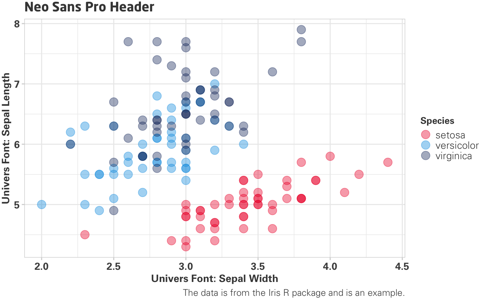
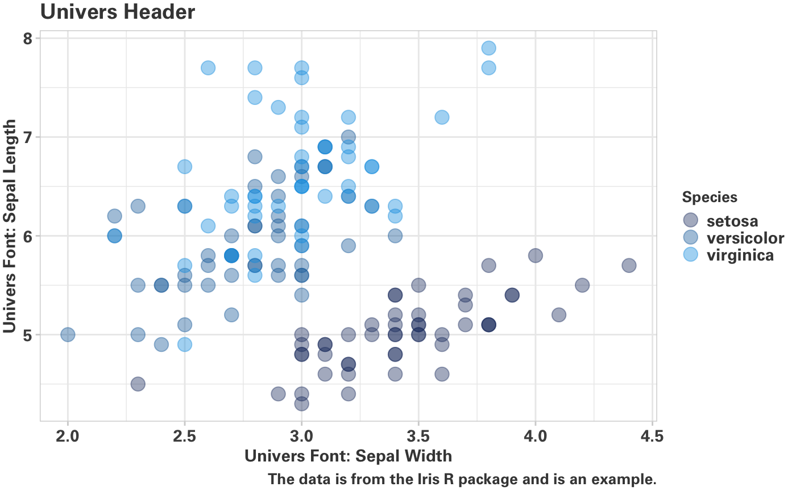
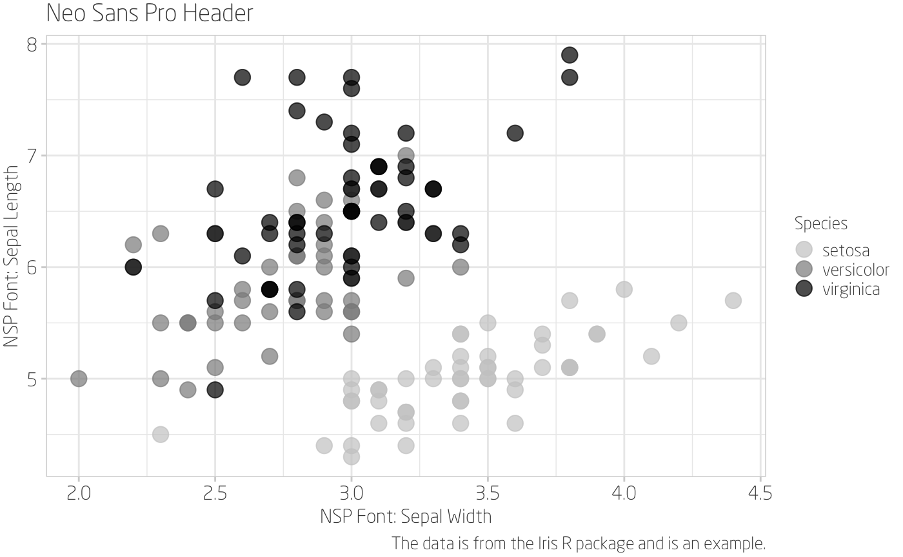
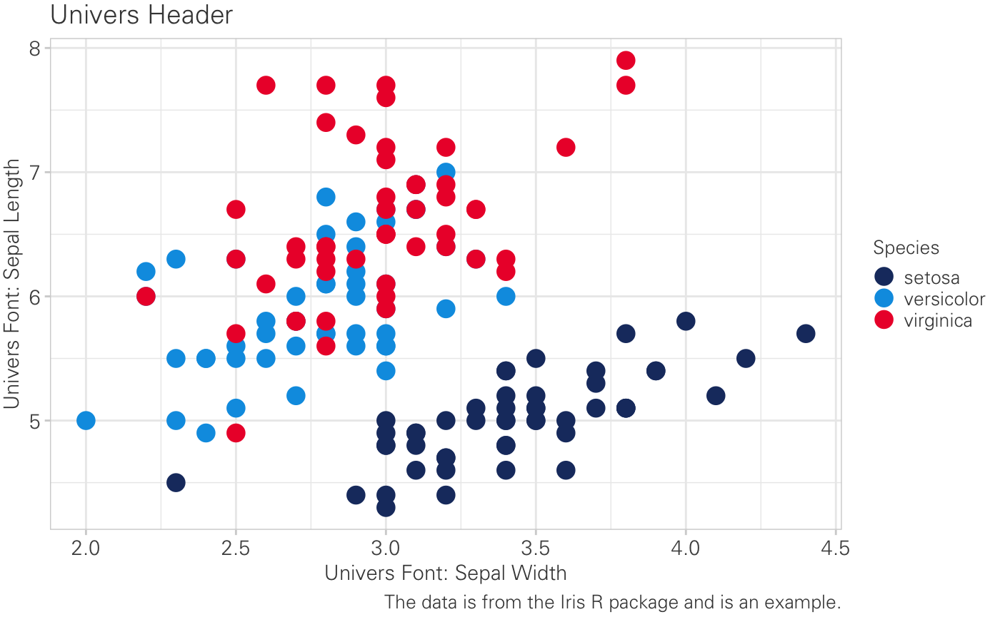

### USSC data visualization

</style>

A standard USSC graph (for `R` users, `theme_ussc()`) has the following elements:

* A title in Neo Sans Pro, size 14

*  Font colour: #444444

* Base text in Univers Ltd

    * Axis titles, size 11

    * Axis text, size 11

    * Axis ticks, #D3D3D3

* Thin grey grid lines (à la Tufte):

    * Panel border colour: #D3D3D3

    * Axis ticks: #D3D3D3

* Legend:

    * Legend text, size 11, Univers Light

    * Legend title, size 10

    * Legend key size (size of point), 10 pts

* Extraneous text:

    * Caption, size 10, Univers Light

    * Subtitle, size 11, Univers Light

* Blank background

* Blank strip background (for facets or small multiples)

* A USSC colour scheme

We also have a Univers-only theme.

* A title in Univers, size 14

* Font colour: #444444

* Base text in Univers Ltd

    * Axis titles, size 11

    * Axis text, size 11

    * Axis ticks, #D3D3D3

* Thin grey grid lines (à la Tufte):

    * Panel border colour: #D3D3D3

    * Axis ticks: #D3D3D3

* Legend:

    * Legend text, size 11

    * Legend title, size 10

    * Legend key size (size of point), 10 pts

* Extraneous text:

    * Caption, size 10

    * Subtitle, size 11

* Blank background

* Blank strip background (for facets or small multiples)

* A USSC colour scheme

Light font versions of the USSC theme are also available:

#### Neo Sans Pro Light

#### Univers Light

 

 

### Tufte Tips (rephrased)

* Keep in mind the data-ink ratio -- data should always "win"

* Erase non-data ink, within reason

* Erase chart junk

* Think about grid lines, axis lines, colours, patterns - are they necessary?

### General data visualization tips

* Avoid plotting graphs with different scales on the same plot or panel

* Direct annotations are preferable to legends

